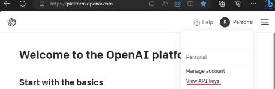
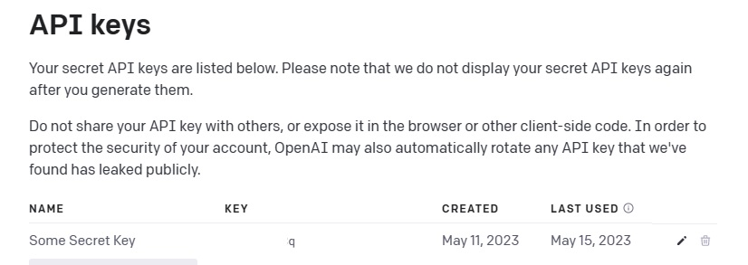

# OpenAI Sentiment Analysis

This code is an example of how to use OpenAI's Completion API to classify the sentiment in a given text using a simple HTTP request.  
[OpenAI API Reference](https://platform.openai.com/docs/api-reference/completions)  

## Getting Started

### Prerequisites

* An [OpenAI account](https://openai.com/)  
[Video on how to open an account](https://www.youtube.com/watch?v=zJSYMWlCcPY)
* API key from the [OpenAI portal](https://platform.openai.com/)  

## Usage

Clone this repository to your local machine.

Open the solution in your developer environment ([Visual Studio Code](https://code.visualstudio.com/), Visual Studio, etc.).

Replace the key variable in Program.cs with your own value from the Open AI portal.  
```C#
Program.cs

string apiUrl = "https://api.openai.com/v1/completions";
string apiKey = "Your-OpenAI-API-Key";
```  

To find the API Key sign into the portal, and click the user profile in the top right corner  
  

Create and store the new key, you will not be able to retieve the value once the create dialog is closed. 
  


Run the code.  
```dotnetcli
dotnet run
```
  
  

## Code Explanation

First, set the key for the OpenAI service, instantiate the HttpClient, HttpRequestMessage and add the Authorization header.  
```C#
using System.Text;
using Newtonsoft.Json;

string apiUrl = "https://api.openai.com/v1/completions";
string apiKey = "Your-OpenAI-API-Key"; // Replace with your API key

var client = new HttpClient();
var request = new HttpRequestMessage(HttpMethod.Post, apiUrl);
request.Headers.Add("Authorization", $"Bearer {apiKey}");
```  

Second, add a statement to the anonymous body object, which represents the request package for the OpenAI Completions API.    
```C#
string statement = "I don't like Pizza.";
var body = new {
    model = "text-curie-001", // Specify the OpenAI model you wish to use
    prompt = $"Classify the sentiment in this text: {statement}",
    temperature = 0,
    max_tokens = 60,
    top_p = 1,
    frequency_penalty = 0,
    presence_penalty = 0
};
```  

Serialize, encode as JSON and set the request content.  
```C#
var objAsJson = JsonConvert.SerializeObject(body);
request.Content = new StringContent(objAsJson, Encoding.UTF8, "application/json");
```

Finally, call the client endpoint, deserialize  and output the response.  
```C#
var response = await client.SendAsync(request);

string jsonResponse = await response.Content.ReadAsStringAsync();
dynamic? result = JsonConvert.DeserializeObject(jsonResponse);
Console.WriteLine(result!.choices[0].text);;
```  
The response is then printed to the console.  

  
  
  


