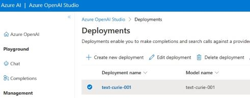
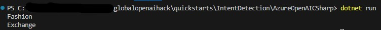

# Azure OpenAI Intent Detection

This code is an example of how to use the Azure.AI.OpenAI client library to determine the intent of a statement and then act on the response.

 [Azure.AI.OpenAI Source code](https://github.com/Azure/azure-sdk-for-net/blob/main/sdk/openai/Azure.AI.OpenAI/src) | [Package (NuGet)](https://www.nuget.org/packages/Azure.AI.OpenAI)

## Getting Started

### Prerequisites

* An [Azure subscription](https://azure.microsoft.com/free/)
* Azure OpenAI subscription.  Access to the Azure OpenAI portal is by application only.  
Apply for access with this [form](https://aka.ms/oai/access?azure-portal=true)  
* API key from the [Azure OpenAI portal](https://learn.microsoft.com/en-us/azure/cognitive-services/openai/how-to/create-resource?pivots=web-portal#create-a-resource)
* Deployed model to reference in [Azure OpenAI Studio](https://learn.microsoft.com/en-us/azure/cognitive-services/openai/how-to/create-resource?pivots=web-portal#deploy-a-model)


## Usage

Clone this repository to your local machine.

Open the solution in your developer environment ([Visual Studio Code](https://code.visualstudio.com/), Visual Studio, etc.).

Replace the endpoint and key variables in Program.cs with your own values from the Azure Open AI portal.  

  

```C#
Program.cs

 string endpoint = "https://your.azure.openai.endpoint/";
 string key = "api-key-found-in-azure-openai";
```

Replace the AzureOpenAI Studio deployment model name with the name of your own deployment model.

  

```C#
Program.cs

 string deploymentName = "AzureOpenAI Studio deployment model name";
```

Run the code.  
```dotnetcli
dotnet run
```
  
  

## Code Explanation

First, set the endpoint and key for the Azure OpenAI service and the Azure OpenAI Studio model name.  
```C#
using Azure;
using Azure.AI.OpenAI;  

string endpoint = "https://your.azure.openai.endpoint/";
string key = "api-key-found-in-azure-openai";
string deploymentName = "AzureOpenAI Studio deployment model name";
```  
Next, create an instance of the OpenAIClient using the endpoint and key.  
```C#
OpenAIClient client = new(new Uri(endpoint), new AzureKeyCredential(key))
```

Then, create a variable of the CompletionsOptions class and set the prompt.  Within the prompt, provide the guidelines for the model's behavior and a sample response.
```C#
var completionsOptions = new CompletionsOptions()
{   Prompts = { @"This is an agent used to detect intent and provide a Department value for the following categories: “Books”, “Home”, “Fashion”, “Electronics”, “Grocery”, “Others”
---
Sample Output
Department: Electronics
Order Intent: Defect

Department: Grocery
Order Intent: Rotten food
---
```

Call the GetCompletions method of the OpenAIClient instance, passing in the name of the AzureOpenAI Studio deployment model and the completionsOptions variable.  
```C#
Response<Completions> completionsResponse = client.GetCompletionsAsync(deploymentName, completionsOptions);
```  
The response is then parsed to a department and orderIntet variable.   
```C#
string[] completionParts = completion.Split(new string[] { "\r\n" }, StringSplitOptions.None);
string department  = "";
string orderIntent = "";
foreach (string part in completionParts)
{	
	if(part.Contains("Department:"))
	{
		department = part.Replace("Department:", "").Trim();
	}else if(part.Contains("Order Intent:"))
	{
		orderIntent = part.Replace("Order Intent:", "").Trim();
	}  
}
```  
After the information is parsed, actions like sending an email, calling a function or raising an event can occurr.  
 
  
  


